# Technical document

## **Abstract:**

Organic solar cells (OSCs) have gained significant attention as a promising renewable energy source due to their low-cost fabrication processes, lightweight and flexible nature, and potential for high power conversion efficiency (PCE). In this technical documentation, we present a strategy for estimating the performances of OSCs, specifically focusing on the case of donor-acceptor (non-fluorene) combinations. We manually prepared a dataset of OSC properties, performed pre-processing including numerical value utilization, removal of null values, and filtering variables based on correlation coefficients. We then trained an XGBoost regressor model on the pre-processed dataset and evaluated its performance using the R2 test score, which yielded a value of 0.64. Finally, we utilized this trained model to identify 10 new donor-acceptor combinations that are predicted to have high performance in terms of OSC properties.

## **Introduction:**

Organic solar cells (OSCs) have emerged as a promising technology for renewable energy generation due to their potential for low-cost fabrication, flexibility, and lightweight nature. OSCs typically consist of a donor and an acceptor material that work together to absorb light, generate charge carriers, and facilitate charge transport. The performance of OSCs depends on various factors such as the molecular structure, energy levels, and morphology of the donor and acceptor materials. Therefore, accurate prediction of OSC performance can significantly aid in the design and development of efficient OSCs.

## **Before our Strategy**

It should be noted that a work of reproduction of the methods of an [article](Technical%20document%20abf424428b554dedb9542f35776d8d40.md)  was first made. In addition to the software used which is not available, the feature engineering strategy used considerably reduced the variables and did not show its effectiveness with our dataset (bad results at r2 test score ) . 


                 **Fig 1 :**Results of the models using the strategy of the article

This led us to redefine a strategy exploiting a fairly varied number of variables as large as possible.We explain it in the following lines

## **Dataset Preparation:**

In this study, we manually prepared a dataset of CSO properties. We initially had only a dataset containing the energy conversion efficiency (ECP or PCE) and the short names of the molecules. The dataset included data from donor-acceptor (non-fluorene) combinations previously reported in the literature (with not only a single active layer but also in tandem).

The software generally used were Chemdraw (to generate the smiles corresponding to the molecule names) and Dragon 2.0 (to generate more than 5000 descriptors per molecule)

**Constraints** :  Chemdraw and Dragon 2.0 are both inaccessible

**Alternatives** : Collect smiles manually and use the python library mordred instead of Dragon 2.0


                                                          **Fig 2 : Details of data construction with smiles**


                                                                      **Fig 3 : Global overview of Data Construction**

                                                                    **Fig 4:** Dataset overview

|  | ABC_donor | ABCGG_donor | nAcid_donor | nBase_donor | SpAbs_A_donor | SpMax_A_donor | SpDiam_A_donor | SpAD_A_donor | SpMAD_A_donor | LogEE_A_donor | … | SRW10_donor | TSRW10_donor | MW_donor | AMW_donor | WPath_donor | WPol_donor | Zagreb1_donor | Zagreb2_donor | mZagreb1_donor | mZagreb2_donor |
| --- | --- | --- | --- | --- | --- | --- | --- | --- | --- | --- | --- | --- | --- | --- | --- | --- | --- | --- | --- | --- | --- |
| 0 | 124.327252 | 84.118682 | 0 | 0 | 204.028157 | 2.635164 | 5.121447 | 204.028157 | 1.324858 | 6.002737 | … | 12.200331 | 221.596299 | 2422.062001 | 10.008521 | 221495 | 290 | 894.0 | 1121.0 | 46.777778 | 33.222222 |
| 1 | 68.613631 | 46.808443 | 0 | 0 | 113.422146 | 2.538887 | 4.841794 | 113.422146 | 1.350264 | 5.404533 | … | 11.522648 | 146.797753 | 1253.110381 | 9.565728 | 45132 | 147 | 488.0 | 606.0 | 20.777778 | 17.944444 |
| 2 | 96.424552 | 65.129270 | 0 | 0 | 160.252377 | 2.651864 | 5.137436 | 160.252377 | 1.335436 | 5.750998 | … | 11.911547 | 185.323116 | 1856.133645 | 9.470070 | 104506 | 217 | 688.0 | 856.0 | 33.555556 | 26.277778 |
| 3 | 66.015914 | 47.400457 | 0 | 0 | 109.669402 | 2.632854 | 5.119109 | 109.669402 | 1.305588 | 5.376136 | … | 11.456873 | 145.943705 | 1328.066774 | 9.623672 | 42881 | 147 | 464.0 | 570.0 | 26.777778 | 18.777778 |
| 4 | 66.015914 | 47.400457 | 0 | 0 | 109.669402 | 2.632854 | 5.119109 | 109.669402 | 1.305588 | 5.376136 | … | 11.456873 | 145.943705 | 1296.125875 | 9.392216 | 42881 | 147 | 464.0 | 570.0 | 26.777778 | 18.777778 |
| … | … | … | … | … | … | … | … | … | … | … | … | … | … | … | … | … | … | … | … | … | … |

NB : 

<aside>
💡 The python code for these steps can be found in the notebook Data Preparation_Train_Data and Data Preparation_Test_Data ( Data Preparation folder ) .

</aside>

## **Pre-processing**

To ensure the accuracy and reliability of the predictive model, we performed pre-processing on the dataset. This included :

- Utilization of **numerical values .** The Boolean values are normally included but were removed because there was only the value "False", which did not provide any information. which did not provide any useful information**.**
- **Removal of null values**
- Filtering variables based on **correlation coefficients** (α) and **mutual info** to select the variables (ß).
- To simplify the experiments we focused on the **Xgboost** and **Random Forest**
- We train our models by varying the hyperparameters via **grid search** and on different batches via **K fold cross validation** and test all the model ont an isolated test data
    
    
    
                                                                      **Fig 5 :**  ML Pipeline for training data
    

We have defined some functions to better organize things, and so by varying a and b we define a number of experiments.
Also, the MLFlow library and more precisely the [MLFlow Tracking](Technical%20document%20abf424428b554dedb9542f35776d8d40.md) packages allow us to structure the experiments, save all the results and generate a dashboard with all the details of these experiments.

```python
run_experiment_corr_plus_mutual_info(data_prep,0.8,10,"experiments_with_corr_O.8 + Mutualinfo_with_top_10vars")
```

This function allows you to configure **an excution type** and launches precisely 10 runs ( 5 folds for each model : Random Forest and Xgboost ) and test the whole on isolated validation data

```mermaid
graph TD;
A[run_experiment_corr_plus_mutual_info : α,ß];
A -- Calls --> B[Correlation Coef < α];
B -- Calls --> C[Mutual Info : select ß vars ];
C -- Calls --> D[CLASS EstimatorSelectionHelper];
D -- Calls --> E[EstimatorSelectionHelper._init_];
E -- Calls --> D[EstimatorSelectionHelper.k_fold_score];
D -- Calls --> E[mlflow.set_experiment];
E -- Calls --> F[mlflow.start_run];
F -- Calls --> G[GridSearchCV.fit];
G -- Calls --> H[gs.score];

```




                                                              **Fig 7 :** Another view of what this function does

NB : 

<aside>
💡 We have used only numeric columns. Some columns of type Object contain some numeric values. We decided not to consider them because it would mean replacing the other values either by the average or the median, which requires more time for reflection in this case

</aside>

<aside>
💡 The use of the mutual information method is optional. After filtering via the correlation coefficient, we can randomly and progressively set the variables to be used for each experimentation.

</aside>

<aside>
💡 The different runs are tested on isolated test data to reduce the comparison bias. But this is only valid when we compare the 10 executions (so 10 models all different) of each "type of experiment". But if we want to compare absolutely all our executions no matter what "type of experiment", it would be a bit biased to do it directly. So we have to select the best models of each type of experience and test them on a new set of tests that they have not seen before

</aside>

## **Model Performance**

Several experiments were run and the model that performed the best, trained XGBoost regressor achieved a test R2 score of 0.64 . This suggests that the model is able to capture the underlying relationships between donor-acceptor combination properties and CSO performance quite well to a large extent.


                                                            **Fig 8 :** Runs View with mlflow

NB : 

<aside>
💡 To launch the experiments, you must launch the notebook of experiments ideally on google colab and the executions will be saved on the drive. And to get the best model, launch the pyngrok command then from mlflow, go to the link generated by pyngrok, you will find the interface of mlflow from which you will find the best model by comparing the scores and you will find in "Artifacts" the instructions to import your model . The url generated by MLFlow works only on the local machine, which explains the use of pyngrok that provides secure tunnels to [localhost](http://localhost) .

</aside>

<aside>
💡 It is possible that the artifacts do not load if there are too many experiments. In this case you can see the id of the execution and search for the model manually in the mlruns folder generated automatically by MLFlow .

</aside>

<aside>
💡 For **collaborators**, you can contact us to have access to the Google drive account of the project that already contain our experiments and with the help of mlflow you will be able to load the artifacts more easily and even test other experiments more easily .

</aside>

## **Result : Prediction of New Combinations**

We utilized the trained model to identify 10 new donor-acceptor combinations that were not present in the training dataset. These combinations were selected based on their predicted high performance in terms of PCE and so can be tested afterwards with one or more active layers (tandem)


                                                  **Fig 9 :** Top 10 D-A(NF) combinaisons

## **Conclusion**

In our work, after a big work of construction of our data sets, in addition to a work of reproduction of the strategies of certain articles, a strategy of experiments with as estimators (Random Forest, XGBoost) was elaborated allowing to select the best model XGBoost having reached a validation R^2 score = 0.64. This model allowed to identify potential combinations to be tested with one or more active layers (tandem)

In terms of optimization perspectives, it would be interesting to test other models, to increase our data and also to see how we could encode the smiles to use them as supplementary variables [**with / without Tranfers Learning**](https://arxiv.org/pdf/1903.03178.pdf)

## **Références**

- «**Accelerating the discovery of high-performance donor/acceptor pairs in photovoltaic materials via machine learning and density functional theory**». 2022. [https://doi.org/10.1016/j.matdes.2022.110561](https://doi.org/10.1016/j.matdes.2022.110561)
- «**Statistical analysis of properties of non-fullerene acceptors for organic photovoltaics**» 2022 [https://doi.org/10.35848/1347-4065/ac4894](https://doi.org/10.35848/1347-4065/ac4894)
- «**Designing Efficient Tandem Organic Solar Cells with Ma-chine Learning and Genetic Algorithms**»  [https://doi.org/10.26434/chemrxiv-2022-tvlp7](https://doi.org/10.26434/chemrxiv-2022-tvlp7) ****
- **MLFlow ( Tracking ) Documentation :** [https://mlflow.org/docs/latest/tracking.html](https://mlflow.org/docs/latest/tracking.html)
- **Scikit-learn Documentation**   [https://scikit-learn.org/stable/index.html](https://scikit-learn.org/stable/index.html)
- **Mordred Doumentaton :** [https://github.com/mordred-descriptor/mordred](https://github.com/mordred-descriptor/mordred)
- **GitHub repository** [https://github.com/LANDRY-SANON/Performance-prediction-of-organic-solar-cells-using-artificial-intelligence](https://github.com/LANDRY-SANON/Performance-prediction-of-organic-solar-cells-using-artificial-intelligence)